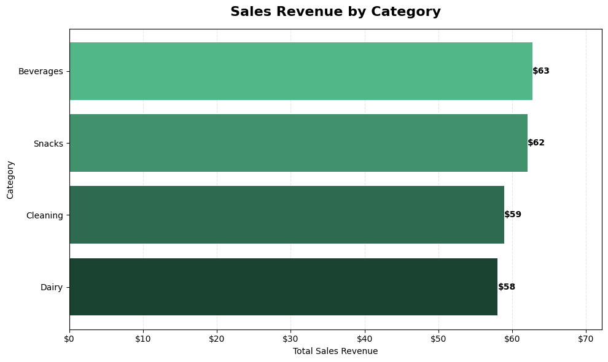
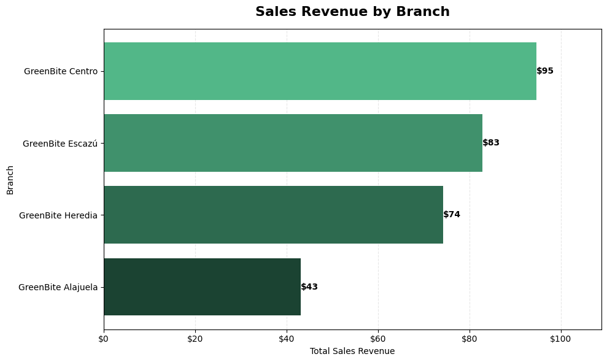
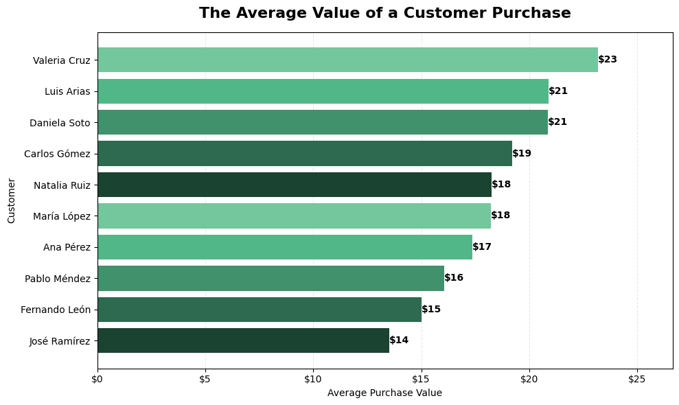

# GreenBite Market — Business Analysis with SQL

A data analysis project using **MySQL, SQL, Python, Pandas, and Matplotlib** to analyze transactional data from a fictional retail chain.

The project focuses on turning **business questions into SQL queries**, extracting meaningful metrics, and communicating results through data analysis and visualization.

---

## Project Highlights

* Designed and queried a relational database with **7 related tables**
* Analyzed customers, products, categories, sales, employees, and branches
* Used **JOINs, aggregations, CTEs, filtering, and multi-level aggregation**
* Extracted SQL results into **Pandas** for further analysis
* Created business-oriented visualizations with **Matplotlib**
* Documented the complete analysis in a **Jupyter Notebook**
* Used environment variables to keep database credentials outside the source code

---

## Business Questions

The project answers **10 business questions** related to:

* Customer purchasing behavior
* Customer spending and purchase frequency
* Product performance
* Category performance
* Sales by branch
* Employee and branch relationships
* Transaction-level analysis
* Average purchase value

Each question follows the same analysis workflow:

**Business Question → SQL Query → Result → Interpretation → Visualization (when relevant)**

---

### Revenue by Category



### Sales Revenue by Branch



### Additional Analysis



---

## Technologies

| Technology                 | Purpose                              |
| -------------------------- | ------------------------------------ |
| **MySQL**            | Relational database                  |
| **SQL**              | Data querying and business analysis  |
| **Python**           | Data analysis and visualization      |
| **Pandas**           | Data extraction and tabular analysis |
| **Matplotlib**       | Data visualization                   |
| **Jupyter Notebook** | Analysis environment                 |
| **python-dotenv**    | Environment variable management      |

---

## Database Structure

The database contains seven related tables:

| Table             | Description                    |
| ----------------- | ------------------------------ |
| `branches`      | Store branches                 |
| `employees`     | Employees assigned to branches |
| `customers`     | Customers                      |
| `sales`         | Sales transactions             |
| `sales_details` | Products included in each sale |
| `products`      | Product catalog                |
| `categories`    | Product categories             |

The database uses **primary and foreign keys** to establish relationships between entities.

```text
categories
    │
    └── products
             │
             └── sales_details
                       │
                       └── sales ─── customers
                              │
                              └── employees ─── branches
```

---

## Project Structure

```text
greenbite-market-sql/
│
├── data/
│   ├── sql/
│   │   ├── database_setup.sql
│   │   ├── data_insertion.sql
│   │   └── business_analysis.sql
│   │
│   └── tables/
│       ├── branches.csv
│       ├── employees.csv
│       ├── customers.csv
│       ├── sales.csv
│       ├── sales_details.csv
│       ├── products.csv
│       └── categories.csv
│
├── notebooks/
│   ├── images/
│   │   ├── Result-Q1.jpg
│   │   ├── Result-Q2.jpg
│   │   └── ...
│   │
│   └── greenbite_business_analysis.ipynb
│
├── .env.example
├── .gitignore
└── README.md
```

---

## Analysis Notebook

The complete analysis is available in:

`notebooks/greenbite_business_analysis.ipynb`

The notebook contains **10 business questions**, with each analysis documenting the reasoning from the business problem to the final result.

The notebook combines:

* SQL queries
* MySQL database connection
* Pandas
* Matplotlib
* Business-oriented interpretation

---

## Reproducibility

The project provides two ways to recreate the database.

### Option 1 — Import the CSV files

The files inside `data/tables/` contain the data for each database table.

They can be imported into MySQL using tools such as the **MySQL Workbench Table Data Import Wizard**.

The tables should be loaded in an order that respects their foreign key relationships.

### Option 2 — Run the SQL scripts

The repository includes SQL scripts for creating and populating the database.

Run them in this order:

```text
1. database_setup.sql
2. data_insertion.sql
3. business_analysis.sql
```

* `database_setup.sql` creates the database structure and relationships.
* `data_insertion.sql` inserts the data into the corresponding tables.
* `business_analysis.sql` contains the SQL queries used for the business analysis.

---

## Environment Variables

The notebook uses environment variables to keep database credentials outside the source code.

Create a `.env` file in the project root based on `.env.example`:

```text
GREENBITE_DB_HOST=
GREENBITE_DB_PORT=
GREENBITE_DB_USER=
GREENBITE_DB_PASSWORD=
GREENBITE_DB_NAME=
```

The `.env` file should **not** be committed to the repository.

---

## SQL Skills Demonstrated

* Relational database analysis
* Primary and foreign key relationships
* `INNER JOIN`
* `LEFT JOIN`
* Multiple-table joins
* `GROUP BY`
* Aggregate functions
* `SUM()`
* `COUNT()`
* `COUNT(DISTINCT)`
* Common Table Expressions (`CTEs`)
* `ORDER BY`
* `LIMIT`
* `WHERE` filtering
* Calculated metrics
* Multi-level aggregation
* Result-set granularity
* Translating business questions into SQL queries

---

## What This Project Demonstrates

This project demonstrates the ability to work with a relational dataset from **database setup through business analysis and visualization**.

The main focus was not only on writing SQL syntax, but on understanding **how tables relate to each other, choosing the appropriate level of aggregation, and translating business questions into measurable results**.
